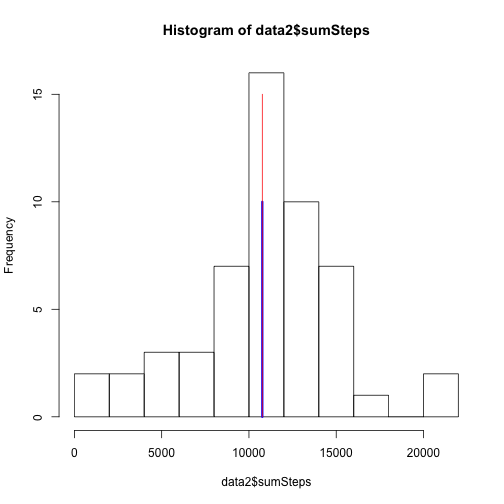
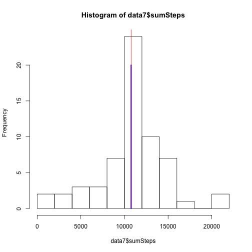
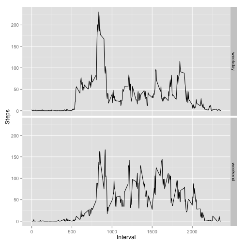

Assignment Analysis of Step Activity (by M. Funke)
========================================================
In this excercise, we will analyse 17568 obs of 3 variables:  
1. number of steps taken in 
a certain interval,   
2. the date,   
3. the interval in question, coded as a number
between 0 and 2355.    


```r
## Read the activity log
library("data.table")
setwd("/Users/mfunke/Downloads/")
data = fread("activity.csv")

## Calculate the means by day (based on daily sums)
data2=data[!is.na(steps), list(sumSteps=sum(steps)), by=date]
mean_steps=mean(data2$sumSteps)
mean_steps
```

```
## [1] 10766.19
```

```r
median_steps=quantile(data2$sumSteps, .5)
median_steps
```

```
##   50% 
## 10765
```

```r
## Prepare the plot
hist(data2$sumSteps, breaks=10)
lines(x=rep(mean_steps, 2), y=c(0,10), col="blue", lwd=3)
lines(x=rep(median_steps, 2), y=c(0,15), col="red")
```

 

Note how I plotted a blue line with the mean and a red one with the median.  
Average Daily Activity
----------------------
Next, we want to find out the average daily activity pattern. This is a simple summarisation of the data.table with a subsequent line plot.


```r
data3=data[!is.na(steps), list(meanSteps=mean(steps)), by=interval]
with(data3, plot(x=interval, y=meanSteps, type="l"))
```

 

Next we want to find out the interval with the maximum number of steps.


```r
# Which 5-minute interval, on average across all the days in the dataset, contains the maximum number of steps?
maxint=max(data3$meanSteps)
data4=data3[meanSteps==maxint, list(interval=interval, meanSteps=meanSteps)]
with(data3, plot(x=interval, y=meanSteps, type="l"))
data4[, lines(x=rep(interval, 2), y=c(-5, meanSteps), col="blue", lwd=2)]
```

 

```
## NULL
```

```r
data4
```

```
##    interval meanSteps
## 1:      835  206.1698
```
# Missing value treatment
*Calculate and report the total number of missing values in the dataset (i.e. the total number of rows with NAs)*


```r
n=data[is.na(steps), .N]
print(n)
```

```
## [1] 2304
```

```r
# create an aux variable with a different name
data3[,interval_:=interval]
```

```
##      interval meanSteps interval_
##   1:        0 1.7169811         0
##   2:        5 0.3396226         5
##   3:       10 0.1320755        10
##   4:       15 0.1509434        15
##   5:       20 0.0754717        20
##  ---                             
## 284:     2335 4.6981132      2335
## 285:     2340 3.3018868      2340
## 286:     2345 0.6415094      2345
## 287:     2350 0.2264151      2350
## 288:     2355 1.0754717      2355
```

```r
# Insert the mean of the same interval for missing values
data5=data[is.na(steps),list(steps=as.integer(round(
        data3[interval_==interval, meanSteps])),
        date, 
        interval
        )]
```
I had to create the auxiliary variable because I wanted to use the same variable inside a bracketed loop, and I don't know how to resolve the scope properly.  


```r
# Combine the filled in data with the original data to create new data set
data6=rbind(data5, data[!is.na(steps),])
# Summarise the data just like we did the first time, by date.
data7=data6[, list(sumSteps=sum(steps)), by=date]
new_mean_steps=mean(data7$sumSteps)
new_median_steps=quantile(data7$sumSteps, .5)
new_mean_steps
```

```
## [1] 10765.64
```

```r
new_median_steps
```

```
##   50% 
## 10762
```

# Histogram of "filled" activity data
*Make a histogram of the total number of steps taken each day and Calculate and report the mean and median total number of steps taken per day. 
Do these values differ from the estimates from the first part of the assignment? What is the impact of imputing missing data on the estimates of the total daily number of steps?*  
The mean and median have not changed much, and that is "by design". The mean and the median are statistical values that are supposed to be robust, and by removing the NA values previously we were just using a smaller sample, and not changing the population.  What has changed, is the frequency of all observations. We added 2304 observations, and of course that is visible in the frequencies.   

```r
hist(data7$sumSteps, breaks=10)
lines(x=rep(new_mean_steps, 2), y=c(0,20), col="blue", lwd=3)
lines(x=rep(new_median_steps, 2), y=c(0,25), col="red")
```

 
Weekdays and weekends
---------------------

```r
# Now for some fun day formatting stuff
data6[,wday:=as.POSIXlt(as.Date(date, format="%Y-%m-%d"))$wday]
```

```
##        steps       date interval wday
##     1:     2 2012-10-01        0    1
##     2:     0 2012-10-01        5    1
##     3:     0 2012-10-01       10    1
##     4:     0 2012-10-01       15    1
##     5:     0 2012-10-01       20    1
##    ---                               
## 17564:     0 2012-11-29     2335    4
## 17565:     0 2012-11-29     2340    4
## 17566:     0 2012-11-29     2345    4
## 17567:     0 2012-11-29     2350    4
## 17568:     0 2012-11-29     2355    4
```

```r
data6[wday==0 | wday==6, type_of_day:="weekend"]
```

```
##        steps       date interval wday type_of_day
##     1:     2 2012-10-01        0    1          NA
##     2:     0 2012-10-01        5    1          NA
##     3:     0 2012-10-01       10    1          NA
##     4:     0 2012-10-01       15    1          NA
##     5:     0 2012-10-01       20    1          NA
##    ---                                           
## 17564:     0 2012-11-29     2335    4          NA
## 17565:     0 2012-11-29     2340    4          NA
## 17566:     0 2012-11-29     2345    4          NA
## 17567:     0 2012-11-29     2350    4          NA
## 17568:     0 2012-11-29     2355    4          NA
```

```r
data6[wday>0 & wday<6, type_of_day:="weekday"]
```

```
##        steps       date interval wday type_of_day
##     1:     2 2012-10-01        0    1     weekday
##     2:     0 2012-10-01        5    1     weekday
##     3:     0 2012-10-01       10    1     weekday
##     4:     0 2012-10-01       15    1     weekday
##     5:     0 2012-10-01       20    1     weekday
##    ---                                           
## 17564:     0 2012-11-29     2335    4     weekday
## 17565:     0 2012-11-29     2340    4     weekday
## 17566:     0 2012-11-29     2345    4     weekday
## 17567:     0 2012-11-29     2350    4     weekday
## 17568:     0 2012-11-29     2355    4     weekday
```

```r
data6$type_of_day=as.factor(data6$type_of_day)
```
Now that we have created the desired factor variable, let's do some plotting.

```r
library("ggplot2")
data8=data6[,mean(steps),by=c("interval", "type_of_day")]
g=ggplot(data8, aes(x=interval, y=V1))+geom_line()+facet_grid(type_of_day~.)
g=g+labs(x="Interval", y="Steps")
print(g)
```

 
  What can we see? It's pretty obvious most people go to work in the morning rush hour, and that creates a visible activity peak during weekdays. At work, they are more passive. 
We can also see that people sleep in during the weekend, with activities generally starting later in the day and being a lot more dispersed over the day, with weekend activities filling the whole day, and lasting longer into the evening.

